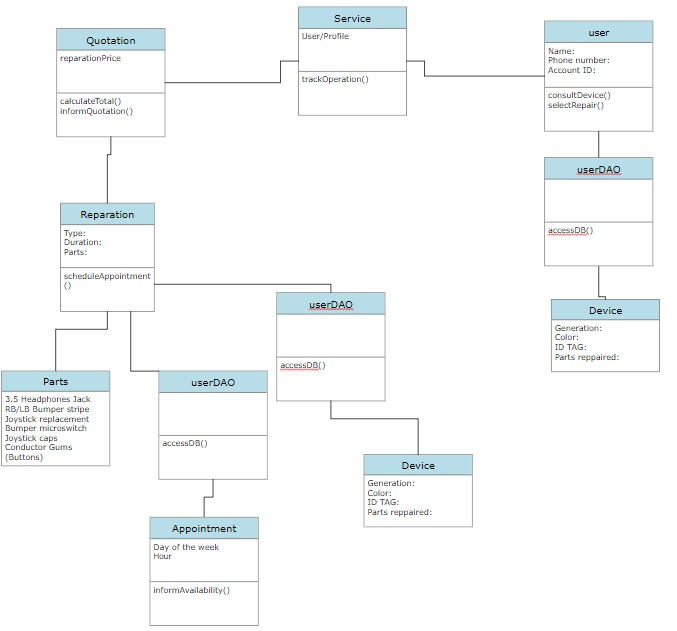

# **USE CASES AND DIAGRAM CLASS** 

**FROM THE SYSTEM**

Made by Ruth Castro

| FROM THE SYSTEM | UC-01 Income                                                 |
| --------------- | ------------------------------------------------------------ |
| STEEP           | ACTION                                                       |
| 0               | The system automatically registers the user in a database with his telegram id identifier and name when step 2 from UC-04 is performed |
| 1               | The bot welcomes                                             |
| 2               | The bot provides a menu of commands (/help and /settings).   |

| FROM SYSTEM     | UC-02 Provide Quotation (It is executed when the user performed step 1 of UC-05) |
| --------------- | ------------------------------------------------------------ |
| STEP            | ACTION                                                       |
| 1               | The system informs the user about the parts and structure of the Xbox controller with a picture. |
| 2               | The system asks you to enter the parts to inform about the price. |
| 3               | Entering '?' is reported when you do not know what part is wrong with the control or it does not appear in the options. |
| 4               | The system asks you to enter 'last' to finalize the quotation. |
| 5               | When the step 2 from UC-05 is performed the system informs the user about the price per piece |
| 6               | When the step 3 from UC-05 is performed the system will inform about the end of the quotation and the total sum of the parts chosen and step 2 from UC-01 is performed. |
| Alternative 0   | The system prompts you to enter the correct option that corresponds to the image when alternative 0 from UC-05 is performed |
| Alternative 3.1 | When Alternative 2.1 from UC-05 is performed the system informs about entering /settings |

| FROM SYSTEM     | UC-03 Agenda (It is executed when the user performed step 1 of UC-06) |
| --------------- | ------------------------------------------------------------ |
| STEEP           | ACTION                                                       |
| 1               | The system informs about the hours and days available for the repair |
| 2               | The system asks you to enter the digit corresponding to the day |
| 3               | Step 2 from UC-06 is performed                               |
| 3               | The system asks to enter '0' to confirm the choice or enter another option from the image to change the day. |
| 4               | The system informs about the time of the scheduled appointment. |
| 5               | The system asks you to enter the digit corresponding to the image to select the time. |
| 6               | The system informs about the chosen time and asks to enter 'end' to confirm or to enter another acceptable option to replace it. |
| 7               | The system informs about the scheduled date and time, in addition to the location |
| Alternative 0   | The system inform about enter /help before /setting when     |
| Alternative 3.1 | Repeat step 3 when Alternative 2.1 from UC-06 is performed.  |
| Alternative 6.1 | Repeat step 6 when Alternative 4.1 from UC-06 is performed   |
| Alternative (X) | The system prompts you to enter the correct option that corresponds to the image when alternative 0 from UC-06 is performed. |

 

**OF THE USER**

| OF THE USER     | UC-04 Income                                                 |
| --------------- | ------------------------------------------------------------ |
| STEEP           | ACTION                                                       |
| 1               | The user accesses by searching for the bot's name on telegram or through a link. |
| 2               | The user interacts with the bot entering any text except the commands /help and /settings |
| 3               | User select the desired command /help for quote.             |
| 4               | UC-05 is performed                                           |
| 5               | User select /settings for schedule.                          |
| 6               | UC-06 is performed                                           |
| Alternative 0   | As long as the user enters text other than the option menu commands step 2 from UC-01 is performed |
| Alternative 3.1 | When user select /settings instead /help first step 1.2 from UC-01 is performed |

| OF THE USER     | UC-05  Select repair                                         |
| --------------- | ------------------------------------------------------------ |
| STEEP           | ACTION                                                       |
| 1               | The user enter the command /help                             |
| 2               | The user enters the desired parts by entering the numbers corresponding to the image, one by one. |
| 3               | User logs in 'last' to finalize part selection and view quotation. |
| Alternative 0   | When the user enters the wrong digit or command Alternative 0 from UC-02 is performed |
| Alternative 2.1 | If the user does not know what type of repair is needed or it is not in the options, the user writes '?' and alternative 3.1 from UC-05 is performed |
| Alternative 3.1 | If the user enters 'last' to end without first entering the digits that correspond to the parts, or enters '?' to continue without choosing parts, Alternative 0 from UC-02 is performed |
|                 |                                                              |

| OF THE USER        | UC-06  Schedule an appointment                               |
| ------------------ | ------------------------------------------------------------ |
| STEEP              | ACTION                                                       |
| 1                  | The user  enter the command /settings.                       |
| 2                  | The user indicates the day of the appointment corresponding to the image. |
| 3                  | The user confirms the choice by entering '0'.                |
| 4                  | The user indicates the hour of the appointment corresponding to the image. |
| 5                  | The user confirms the choice by entering 'fin'.              |
| Alternative 0      | When the user enters the wrong digit or command, Alternative (X) is performed. |
| Alternative 2.1    | If in step 2  the user wishes to change, he/she only has to return to step 2 of this UC. |
| Alternative    1.1 | if the user enters the /settings command without having previously made the quotation with /help, Alternative 0 from UC-03 is performed |
| Alternative 4.1    | If in steps 4 the user wishes to change, he/she only has to return to step 4 of this UC. |
|                    |                                                              |

 CLASS DIAGRAM
 

